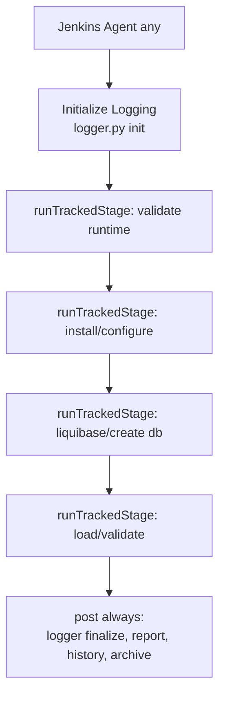

# 08 — Jenkins Pipeline Architecture

## 1. Two pipeline families

### Family A — Main / Centralized (`jenkins/Jenkinsfile`)
- Declarative pipeline, `agent none` at root (controller does no heavy work).
- `disableConcurrentBuilds()`.
- **Parameters:** `DATABASE` (MYSQL/MSSQL/MONGODB/POSTGRESQL), `ACTION` (SETUP/LOAD/CLEANUP),
  `CLEANUP_MODE` (PRESERVE_DATA/DELETE_DATA), `USERNAME`, `PASSWORD` (RBAC).
- `stage('Validate Selection')` runs on `agent any`; remaining stages are gated by `when { allOf { ... } }`
  expressions on `params.DATABASE`, `params.ACTION`, and `currentBuild.number > 1` (first build only registers
  parameters).
- Each DB/Action stage declares its own agent label:
  - MySQL, MSSQL → `ubuntu-node`
  - MongoDB, PostgreSQL → `windows-node`
- A shared Groovy function `executePipeline(database, action, operatingSystem, closure)` wraps every stage body
  with: RBAC auth → RBAC authorize → logger init → body → logger finalize → report generation → archiveArtifacts.

### Family B — Standalone (`jenkins/<db>/<os>/<phase>_pipeline.groovy`)
- Declarative, `agent any`.
- No build parameters; DB + OS + action are fixed by the file name.
- A local `runTrackedStage(name, closure)` helper emits `logger.py stage-start/-end/set-error` around each stage.
- Explicit `Initialize Logging` stage; `post { always }` finalizes logging, generates report + history, and
  archives artifacts.
- 24 standalone pipelines exist (see `04_THREE_EXECUTION_MODES.md` matrix).

## 2. Main Jenkins multi-node flow

```mermaid
flowchart TD
    C[Jenkins Controller<br/>Jenkinsfile: agent none] --> VS[Validate Selection<br/>agent any]
    VS --> ROUTE{RATABASE + ACTION}
    ROUTE -->|MYSQL/MSSQL| UB[agent: ubuntu-node]
    ROUTE -->|MONGODB/POSTGRESQL| WIN[agent: windows-node]
    UB --> RE[executePipeline wrapper:<br/>RBAC auth+authz, logger init, body, finalize, report]
    WIN --> RE
    RE --> SCR[DB/OS batch|bash scripts]
    SCR --> DB[(Database)]
```

## 3. Standalone Jenkins flow



## 4. Stage ordering (PostgreSQL Setup, Main Jenkins)

1. `validate_python_runtime`
2. `install_python_requirements` → `validate_python_requirements`
3. `validate_java_runtime`
4. `install_tools`
5. `deploy_postgresql` (Terraform)
6. `configure_postgresql_service` / `start_postgresql` (admin-branch)
7. `create_database`
8. `run_liquibase`
9. `configure_global_psql`
10. `validate_environment`

## 5. Conditional routing

- First build (`currentBuild.number == 1`) only prints parameters; all DB stages are skipped via `when`.
- DB + action chosen by parameters; OS chosen by hard-coded agent label per stage.
- Within standalone PG setup, `Configure PostgreSQL Service` runs only if `admin_status.txt == 'true'`,
  otherwise `Start PostgreSQL` runs (project-local mode).

## 6. Credentials

- RBAC `USERNAME`/`PASSWORD` are build parameters (password type). Passed to `auth_cli.py`/`cli.py` via
  `sh`/`bat` (echoed in Jenkins console for the password arg — see Security doc).
- Database credentials are **not** Jenkins credentials; they come from `config/<os>/<db>.conf` (plaintext).

## 7. Logging / Reports / Failure

- `executePipeline` guarantees `logger.py finalize` + `generate_report.py` + `generate_history.py` in a `finally`
  block even on failure, then re-throws the original error so the build fails.
- `archiveArtifacts` captures `logs/`, `reports/`, `metadata/`, `outputs/assessments/`.
- Standalone pipelines do the same in `post { always }`.
- Viewer role short-circuits: publishes the executive migration report and returns without running automation.

## 8. Main vs Standalone — key differences

| Aspect | Main Jenkins | Standalone Jenkins |
|--------|--------------|--------------------|
| Entry | One job, parameters | Dedicated job per DB/OS |
| Agent | `agent none` + per-stage labels | `agent any` |
| RBAC | Yes (`executePipeline`) | Not present in verified standalone files |
| Stage tracking | Coarse (whole body) | Per-stage (`runTrackedStage`) |
| Routing | Parameter-driven | Fixed by filename |
| Reporting | Yes | Yes |
