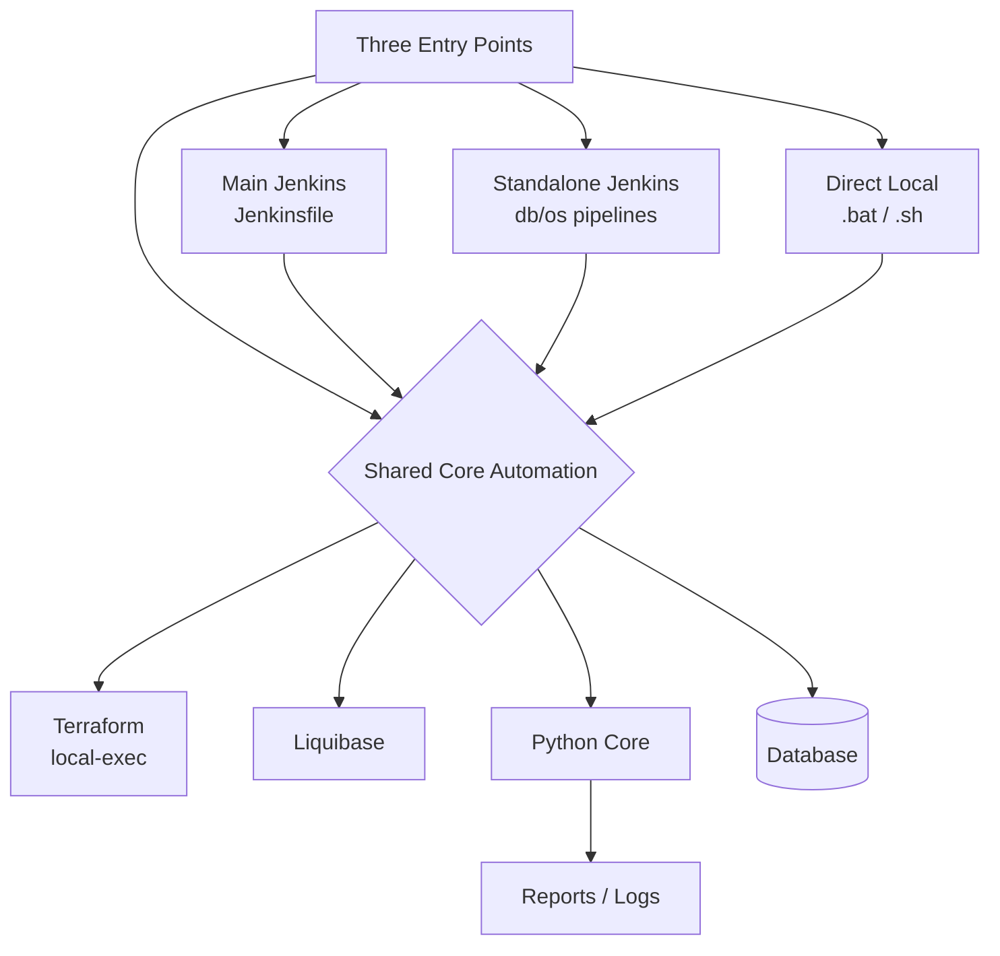

# README — Database Automation Platform (ObjectsV4)

> As-built technical documentation. Derived from the actual current codebase, not from `docs/`.
> Status: **PARTIAL** (verified by static inspection only — no runtime execution was performed).

## Project Summary

A self-contained database automation platform that installs, configures, deploys schema to, loads data into,
and validates **MySQL, PostgreSQL, Microsoft SQL Server, and MongoDB** across **Windows** and **Ubuntu Linux**
using **Terraform** (local provisioning), **Liquibase** (schema migration), **Python** (core logic),
**Batch/PowerShell/Bash** (OS-specific orchestration) and **Jenkins** (CI/CD orchestration with RBAC).

## Problem Solved

Manually installing databases, deploying schema, loading datasets, generating database objects (views,
procedures, functions, triggers, indexes, etc.), applying role-based access control, and validating results is
repetitive and error-prone. This platform codifies those steps as reusable, parameterized, cross-OS automation.

## Architecture (One Line)

A **shared core** of Python/Terraform/Liquibase automation is reachable through **three interchangeable entry
points** — a master Jenkins pipeline, per-database/OS standalone Jenkins pipelines, and direct `.bat`/`.sh`
launchers — all reading the same `config/*.conf` files and producing the same logs/reports.

## Three Execution Modes

| Mode | Entry Point | Best For |
|------|-------------|----------|
| 1. Main / Centralized Jenkins | `jenkins/Jenkinsfile` (`agent none`, routes to `windows-node` / `ubuntu-node`) | Central orchestration of any DB/OS/action from one job |
| 2. Standalone Jenkins | `jenkins/<db>/<os>/setup_pipeline.groovy`, `load_pipeline.groovy`, `cleanup_pipeline.groovy` | Independent DB/OS testing & debugging in Jenkins |
| 3. Direct Local (no Jenkins) | `scripts/batch/<db>/<db>_setup_pipeline.bat`, `scripts/bash/<db>/<db>_setup_pipeline.sh` | Local dev, debugging, Jenkins-free runs |

All three call the **same underlying batch/bash/Python scripts**, so behaviour is consistent.

## Supported Databases

| Database | Windows | Ubuntu | Notes |
|----------|---------|--------|-------|
| MySQL | SETUP/LOAD | SETUP/LOAD | Mature; MSSQL-style load scripts |
| PostgreSQL | SETUP/LOAD | SETUP/LOAD | Most complete (objects incl. materialized views, extensions) |
| Microsoft SQL Server | SETUP/LOAD | SETUP/LOAD | Ubuntu via Docker path; Windows via installer |
| MongoDB | SETUP/LOAD (Windows) | SETUP/LOAD (Ubuntu) | Document store; collections/indexes only |

## Supported Operating Systems

- **Windows** (Batch + PowerShell)
- **Ubuntu Linux** (Bash)

## Core Capabilities

- Database install / start / stop / configure (Terraform `null_resource` local-exec)
- Schema deployment (Liquibase changelogs)
- Dataset loading (CSV/JSON, chunked, idempotent skip mode)
- Database object automation (views, functions, procedures, triggers, indexes, events, materialized views, extensions)
- RBAC gate (authentication + authorization) before pipeline execution
- Validation (runtime, environment, schema, data, objects)
- Reporting (HTML + JSON execution reports, history)
- Discovery / assessment / reconciliation / recommendation engines (migration analytics)

## Quick Architecture Diagram

## Documentation Index

| # | Document |
|---|----------|
| 01 | `01_EXECUTIVE_PROJECT_OVERVIEW.md` |
| 02 | `02_SYSTEM_ARCHITECTURE.md` |
| 03 | `03_PROJECT_DIRECTORY_STRUCTURE.md` |
| 04 | `04_THREE_EXECUTION_MODES.md` |
| 05 | `05_DATABASE_SUPPORT_MATRIX.md` |
| 06 | `06_CONFIGURATION_ARCHITECTURE.md` |
| 07 | `07_EXECUTION_AND_CALL_FLOW.md` |
| 08 | `08_JENKINS_PIPELINE_ARCHITECTURE.md` |
| 09 | `09_WINDOWS_VS_UBUNTU_EXECUTION.md` |
| 10 | `10_TERRAFORM_AUTOMATION.md` |
| 11 | `11_LIQUIBASE_SCHEMA_AUTOMATION.md` |
| 12 | `12_DATA_LOADING_ARCHITECTURE.md` |
| 13 | `13_METADATA_ARCHITECTURE.md` |
| 14 | `14_DATABASE_OBJECT_AUTOMATION.md` |
| 15 | `15_RBAC_AUTOMATION.md` |
| 16 | `16_VALIDATION_FRAMEWORK.md` |
| 17 | `17_LOGGING_REPORTING_AND_OUTPUTS.md` |
| 18 | `18_DEPENDENCIES_AND_PREREQUISITES.md` |
| 19 | `19_END_TO_END_WORKFLOWS.md` |
| 20 | `20_AS_BUILT_IMPLEMENTATION_STATUS.md` |
| 21 | `21_DEVELOPER_RUNBOOK.md` |
| 22 | `22_TROUBLESHOOTING_GUIDE.md` |
| 23 | `23_DEMO_AND_EXPLANATION_GUIDE.md` |
| 24 | `24_GLOSSARY.md` |

Diagrams: `PROJECT_DOCUMENTATION/diagrams/*.mmd` and `*.md`.
Evidence CSVs: `PROJECT_DOCUMENTATION/_evidence/*.csv`.

## Recommended Reading Order

1. `23_DEMO_AND_EXPLANATION_GUIDE.md` (for managers / quick understanding)
2. `01_EXECUTIVE_PROJECT_OVERVIEW.md`
3. `04_THREE_EXECUTION_MODES.md`
4. `02_SYSTEM_ARCHITECTURE.md`
5. `08_JENKINS_PIPELINE_ARCHITECTURE.md`
6. Capability deep-dives (10–16)
7. `20_AS_BUILT_IMPLEMENTATION_STATUS.md` (honest current state)

## Implementation Status (Summary)

- Jenkins master + standalone pipelines: **IMPLEMENTED**
- Three execution modes sharing core scripts: **VERIFIED**
- Terraform local provisioning: **IMPLEMENTED** (local-exec only)
- Liquibase schema + object deployment: **IMPLEMENTED** (runtime-generated changelogs)
- Data loading: **IMPLEMENTED** (CSV/JSON, idempotent)
- Database object automation: **IMPLEMENTED** (generation); deployment via Liquibase
- RBAC: **IMPLEMENTED** (CLI gate; file-based credentials)
- `scripts/run_liquibase.py` legacy runner: **LEGACY / NOT USED BY PIPELINES** (hardcodes MySQL + scans non-existent `liquibase/generated/`)
- `deploy_objects.bat` → `check_schema_changed.py`: **BROKEN** (referenced Python file is absent)

See `20_AS_BUILT_IMPLEMENTATION_STATUS.md` for the full matrix.

## Demo Guide

See `23_DEMO_AND_EXPLANATION_GUIDE.md`.

## Safety Note

This documentation was produced by **static inspection only**. Source code, Jenkinsfiles, Terraform, Liquibase,
and configuration were **not modified**. No `terraform apply`, `liquibase update`, or database operations were run.
