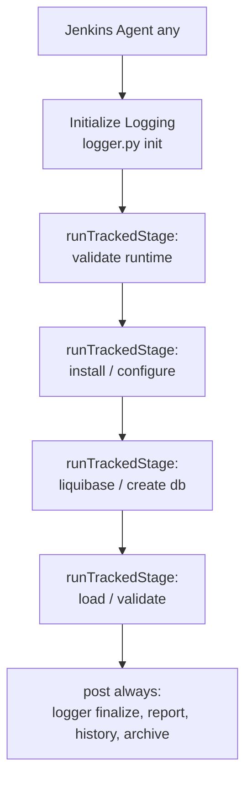

# 04 — Standalone Jenkins Flow

```mermaid
flowchart TD
    N[Jenkins Agent any] --> IL[Initialize Logging<br/>logger.py init]
    IL --> S1[runTrackedStage:<br/>validate runtime]
    S1 --> S2[runTrackedStage:<br/>install / configure]
    S2 --> S3[runTrackedStage:<br/>liquibase / create db]
    S3 --> S4[runTrackedStage:<br/>load / validate]
    S4 --> POST[post always:<br/>logger finalize, report, history, archive]
```
