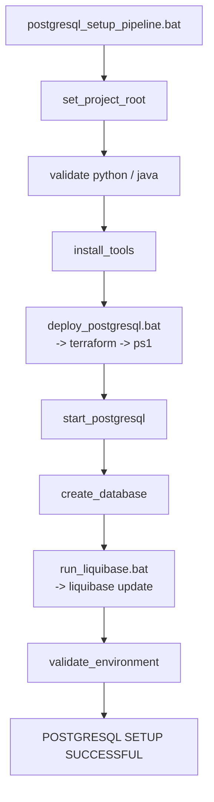

# 05 — Direct Local Execution Flow

```mermaid
flowchart TD
    A[postgresql_setup_pipeline.bat] --> B[set_project_root]
    B --> C[validate python / java]
    C --> D[install_tools]
    D --> E[deploy_postgresql.bat<br/>-> terraform -> ps1]
    E --> F[start_postgresql]
    F --> G[create_database]
    G --> H[run_liquibase.bat<br/>-> liquibase update]
    H --> I[validate_environment]
    I --> J[POSTGRESQL SETUP SUCCESSFUL]
```
