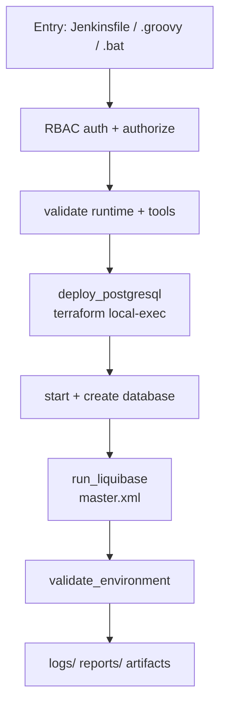

# 06 — End-to-End Setup Flow

```mermaid
flowchart TD
    A[Entry: Jenkinsfile / .groovy / .bat] --> B[RBAC auth + authorize]
    B --> C[validate runtime + tools]
    C --> D[deploy_postgresql<br/>terraform local-exec]
    D --> E[start + create database]
    E --> F[run_liquibase<br/>master.xml]
    F --> G[validate_environment]
    G --> H[logs/ reports/ artifacts]
```
