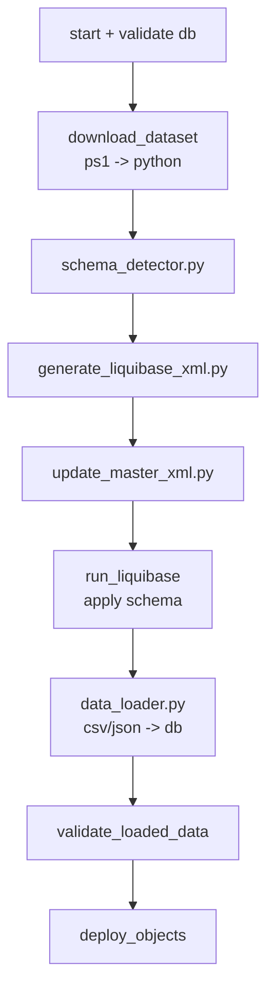

# 07 — Data Load Flow

```mermaid
flowchart TD
    A[start + validate db] --> B[download_dataset<br/>ps1 -> python]
    B --> C[schema_detector.py]
    C --> D[generate_liquibase_xml.py]
    D --> E[update_master_xml.py]
    E --> F[run_liquibase<br/>apply schema]
    F --> G[data_loader.py<br/>csv/json -> db]
    G --> H[validate_loaded_data]
    H --> I[deploy_objects]
```
