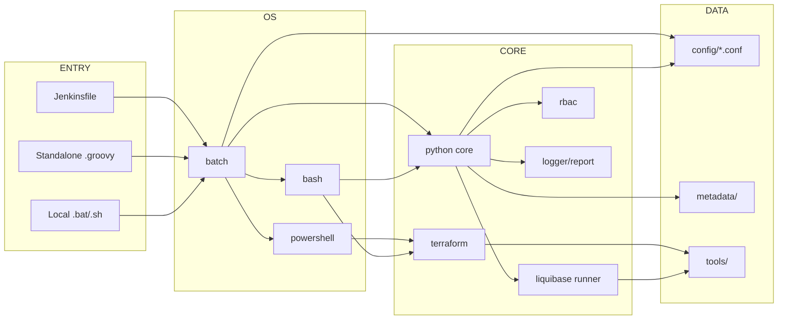

# 12 — Component Dependency Diagram

```mermaid
flowchart LR
    subgraph ENTRY
        J[Jenkinsfile]
        G[Standalone .groovy]
        L[Local .bat/.sh]
    end
    subgraph OS
        B[batch]
        SH[bash]
        PS[powershell]
    end
    subgraph CORE
        TF[terraform]
        LQ[liquibase runner]
        PY[python core]
        RB[rbac]
        LG[logger/report]
    end
    subgraph DATA
        CONF[config/*.conf]
        META[metadata/]
        TOOLS[tools/]
    end
    J --> B
    G --> B
    L --> B
    B --> PS
    B --> SH
    B --> PY
    SH --> PY
    PS --> TF
    SH --> TF
    PY --> LQ
    PY --> RB
    PY --> LG
    B --> CONF
    PY --> CONF
    PY --> META
    TF --> TOOLS
    LQ --> TOOLS
```
